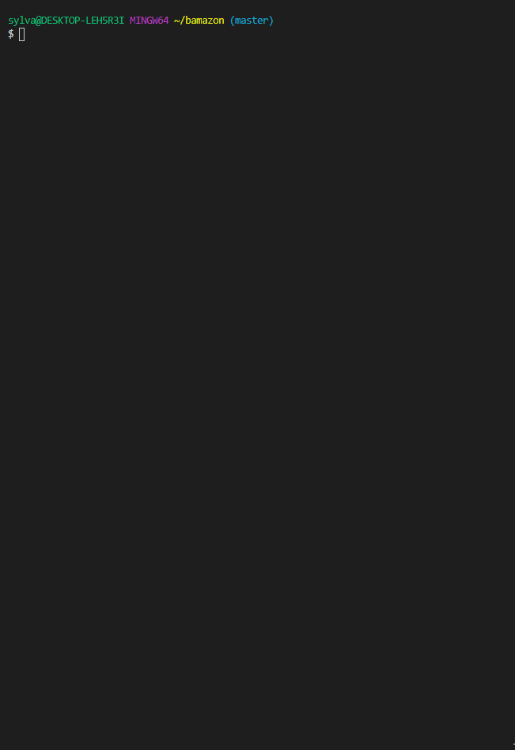

# BAMAZON #
## Table of Content ##
*Overview*
*Installation*
*Customer View*
*Manager View*
*Supervisor View*

## Overview ##
BAMAZON is a *Node.js* command line interface that utilizez MySQL database to create a virtual store experience. Users can take on the role of either customer, manager, or supervisor and interact with the store through different commands.

## Installation ##
### Step 1: Git Clone ###
Clone Bamazon to your local git repo like the following:

The Bamazon project and its files should now be in your project folder.

###Step 2: Install Dependencies###
Install the following dependencies listed in the *package.json* file:

*inquirer*
*mysql*
*console.table*
*dotenv*
*npm install*

Once completed, you will see a *node_modules* folder in your local repo.

The dependencies should now be in the local node_modules folder.

### Step 3: Set up MySQL database ###
Open the schema.sql file via MySQL
OR you can open schema.sql via VS Code and copy paste the code into MySQL

## Customer View ##
Open up terminal
Use bash command *cd* to direct to your local repo folder
In terminal enter *node bamazonCustomer.js*
You will see connected as id in your terminal window to indicate successful connection to MySQL
*Enter the Item Id (table's first column) of the product you wish to purchase*
Then you will be prompted to enter the quantity of products you wish to purchase
Next either your purchase total or an alert of insufficient inventory will display
After each purchase, you can choose to continue or exit by using the up and down arrow keys on your keyboard (exit early with ctrl + c)
If you select no, connection to your MySQL ends

Demo for Customer View

## Manager View ##
Open up terminal
Use bash command cd to direct to your local repo folder
In terminal enter *node bamazonManager.js*
You will see connected as id in your terminal window to indicate successful connection to MySQL
You will then be prompted 4 options:
*View Products*
*View Low Inventory*
*Add to Inventory*
*Add New Products*
*View Low Inventory* option displays items with quantity < 5
*Add New Products* will prompt the user to select a department. Note that this a rawlist so option selection must be done through the number keys.
After each manage, you can choose to continue or exit by using the up and down arrow keys on your keyboard (exit early with ctrl + c)
If you select no, connection to your MySQL ends Demo for Manager View

Demo for Manager View

## Supervisor View ##
Open up terminal
Use bash command cd to direct to your local repo folder
In terminal enter *node bamazonSupervisor.js*
You will see connected as id in your terminal window to indicate successful connection to MySQL
You will be prompted 2 options:
*View Sales by Departments*
*Add New Departments*
*View Sales by Departments* give you an overview of the PnL of each department. Note that Sales and Pnl are not part of our table in MySQL. Instead, they are created on the fly
After each supervise, you can choose to continue or exit by using the up and down arrow keys on your keyboard (exit early with ctrl + c)
If you select no, connection to your MySQL ends Demo for Supervisor View

Demo for Supervisor View

## Technologies used ##

* Node.js
* Javascript
* NPM packages: 
  console.table
  dotenv
  inquirer
  mysql
  prompt
  
## Authors ##
Sylvain David - Vanderbilt Bootcamp - 2019